<picture>
  <source media="(prefers-color-scheme: dark)" srcset="./assets/profile-hero-dark.svg">
  <source media="(prefers-color-scheme: light)" srcset="./assets/profile-hero-light.svg">
  
</picture>

<h1 align="center">Tanvir Ahmed Arnab</h1>

  <strong>C# Gameplay Programmer · Unity Systems · .NET Tools</strong> 
  I build readable, testable systems and turn technical complexity into clear player experiences.

  
  
  

## What I build

My work sits where **gameplay engineering**, **developer tooling**, and **technical communication** meet. C# is my primary language: I use it in Unity gameplay systems, ASP.NET Core applications, automation, tests, and learning projects designed to make architecture understandable.

- **Gameplay and simulation:** deterministic systems, camera and interaction services, UI state, object pooling, data-driven authoring, and accessibility-aware presentation.
- **Engineering discipline:** automated tests, explicit architecture, reproducible builds, source and asset provenance, and reviewable technical documentation.
- **Tools and web:** .NET, ASP.NET Core Razor Pages, Entity Framework Core, SQLite, and small tools that support production workflows.

## Featured release

### [Solar System Simulation](https://github.com/TanvirAhmedArnab/SolarSystem) — Unity 6, C#, URP

> A released educational simulation with deterministic analytical orbits, exact Earth-relative body scaling, free-flight exploration, and a five-chapter cinematic tour.

- Built a double-precision simulation domain with float-space rendering and `ScriptableObject`-authored celestial data.
- Composed navigation, selection, focus, time, audio, UI, scale-comparison, and cinematic-tour services without duplicating simulation state.
- Reused six collider-free comet instances through a deterministic object pool.
- Validated the project with **208 Edit Mode** and **26 real-scene Play Mode** test cases.
- Shipped WebGL and Windows builds with documented release checks, scientific sourcing, and third-party licensing.

**[Play the WebGL release](https://tanvirahmedarnab.itch.io/solar-system-simulation)** · **[Review the source](https://github.com/TanvirAhmedArnab/SolarSystem)** · **[Read the technical design](https://github.com/TanvirAhmedArnab/SolarSystem/blob/main/Docs/Technical/TDD.md)**

## Selected C# and .NET work

| Project | Engineering focus | Evidence |
| :--- | :--- | :--- |
| **[Game Bug Tracker](https://github.com/TanvirAhmedArnab/game-bug-tracker)** | ASP.NET Core Razor Pages application with EF Core, SQLite, validation, seeded demo data, and owner-only write access. | [Source](https://github.com/TanvirAhmedArnab/game-bug-tracker) ·  |
| **[GenericRpg — Book 1 companion](https://github.com/TanvirAhmedArnab/book-01-foundations-and-first-principles)** | A playable .NET 10 console RPG with 25 immutable chapter checkpoints that keep published teaching material synchronized with runnable code. | [Source](https://github.com/TanvirAhmedArnab/book-01-foundations-and-first-principles) ·  |
| **[Media Library System](https://github.com/TanvirAhmedArnab/MediaLibrarySystem)** | Object-oriented C# design using abstraction, interfaces, polymorphism, validation, exception handling, and XML documentation. | [Source](https://github.com/TanvirAhmedArnab/MediaLibrarySystem) |

## Toolkit

  
  
  
  
  
  
  
  

<strong>How I approach production work</strong>

I prefer small, explicit systems with clear ownership and observable behavior. Runtime and editor concerns stay separated; data is authored independently from behavior; tests protect contracts that matter; and release, licensing, and validation decisions remain documented beside the code. AI-assisted suggestions are reviewed rather than accepted blindly.

## Let’s connect

I’m interested in opportunities where **C#**, **Unity**, **.NET**, gameplay systems, internal tools, and strong technical communication matter.

**[Portfolio](https://www.tanvirahmedarnab.com/portfolio.html)** · **[Resume](https://www.tanvirahmedarnab.com/resume.html)** · **[LinkedIn](https://www.linkedin.com/in/taanb/)** · **[Email](mailto:contact@tanvirahmedarnab.com)**
